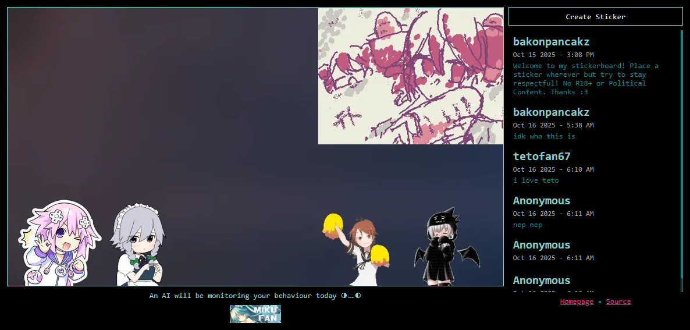

# 🍡 `tools-stickerboard`

A program that allows trolls to paste inappropriate stickers on my [Gitea Profile](https://git.panca.kz/bakonpancakz).
Contribute to the efforts [here](https://stickers.panca.kz)!

    
    <h6 align="center">some basic css edits will get you far</h6>

### *Featuring...*
- AI Image Moderation using [nsfw_model](https://github.com/GantMan/nsfw_model)
- Resonably Efficient Rendering
- Support for **WEBP**, **PNG**, **JPEG**, **Animated GIF** Formats
- Awesome Sauce Hatsune Miku Themed Website

## ⚙️ Configuration
This application requires that [CGO](https://go.dev/wiki/cgo) and [Tensorflow](https://www.tensorflow.org/install/lang_c) be installed and setup on your machine.

> Additionally you must include the `resources` folder with the **executable**.

You can set these using environment variables or a `.env` file in the working directory. Required Variables are marked with an asterisk `*`.

| Environment Variable | Default          | Description                                                           |
| -------------------- | ---------------- | --------------------------------------------------------------------- |
| `DATA_DIRECTORY`     | `./data`         | Path to Data Directory                                                |
| `HTTP_PROXY_HEADER`  | *(none)*         | Retrieve IP Address (for ratelimiting) from the following HTTP Header |
| `HTTP_ADDRESS`       | `localhost:8080` | Accept Incoming Requests on given Host and Port                       |
| `TLS_ENABLED`        | `false`          | Enable TLS?                                                           |
| `TLS_CERT`           | *(none)*         | Path to Certificate                                                   |
| `TLS_KEY`            | *(none)*         | Path to Private Key                                                   |
| `TLS_CA`             | *(none)*         | Path to CA Bundle                                                     |

- **💡 TIP:** You can set a custom background by placing a `854x480px PNG` named **background.png** in the **data directory**.